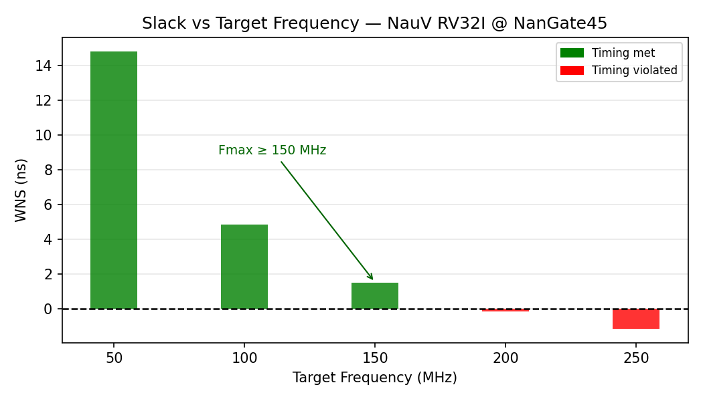
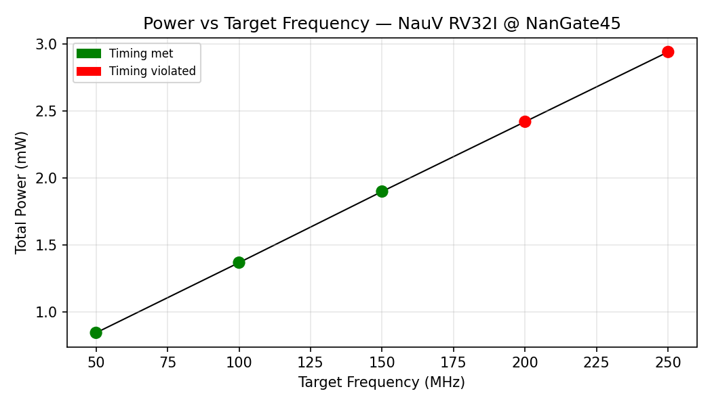
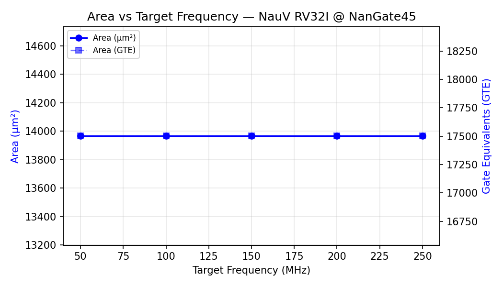

# Nau-V

A single-cycle **RV32I** RISC-V processor core written in SystemVerilog, generated with [Claude Code](https://claude.ai/code).

Nau-V implements the full base integer instruction set (RV32I) and is designed to be simulated with Verilator. The microarchitecture is deliberately partitioned into the five classic pipeline stages — IF, ID, EX, MEM, WB — to make a future five-stage pipelined version straightforward to build by inserting pipeline registers between the existing stage modules.

---

## Table of Contents

1. [Repository Layout](#repository-layout)
2. [Architecture](#architecture)
   - [Memory Map](#memory-map)
   - [Data Path](#data-path)
3. [RTL Modules](#rtl-modules)
   - [IF — `if_stage`](#if--if_stage)
   - [ID — `decoder`](#id--decoder)
   - [ID — `regfile`](#id--regfile)
   - [ID — `id_stage`](#id--id_stage)
   - [EX — `alu`](#ex--alu)
   - [EX — `ex_stage`](#ex--ex_stage)
   - [MEM — `mem_stage`](#mem--mem_stage)
   - [WB — `wb_stage`](#wb--wb_stage)
   - [Core — `imem`](#core--imem)
   - [Core — `dmem`](#core--dmem)
   - [Core — `core`](#core--core-top-level)
4. [Testbenches](#testbenches)
5. [Software](#software)
   - [Bare-Metal Infrastructure](#bare-metal-infrastructure)
   - [Hello World](#hello-world)
6. [Synthesis](#synthesis)
   - [Results](#results)
   - [Frequency Sweep](#frequency-sweep)
7. [Tools & Dependencies](#tools--dependencies)
8. [Useful Commands](#useful-commands)

---

## Repository Layout

```
NauV/
├── src/
│   ├── if/         # Instruction Fetch stage
│   │   └── if_stage.sv
│   ├── id/         # Instruction Decode & Register Read stage
│   │   ├── decoder.sv
│   │   ├── regfile.sv
│   │   └── id_stage.sv
│   ├── ex/         # Execute stage
│   │   ├── alu.sv
│   │   └── ex_stage.sv
│   ├── mem/        # Memory Access stage
│   │   └── mem_stage.sv
│   ├── wb/         # Write Back stage
│   │   └── wb_stage.sv
│   └── core/       # Top-level integration + memories
│       ├── imem.sv
│       ├── dmem.sv
│       └── core.sv
├── tb/             # SystemVerilog testbenches
│   ├── tb_alu.sv
│   ├── tb_regfile.sv
│   ├── tb_decoder.sv
│   ├── tb_if_stage.sv
│   ├── tb_core.sv
│   └── tb_prog.sv  # Generic program runner
├── sim/
│   └── Makefile    # Verilator build + run targets
├── software/
│   ├── startup/    # Shared bare-metal runtime (startup.S, link.ld, bin2hex.py)
│   └── hello/      # Example C program
├── synth/
│   ├── Makefile    # Synthesis targets: synth, timing, sweep, clean
│   ├── scripts/
│   │   ├── synth.ys          # Yosys script (baseline 100 MHz)
│   │   ├── synth.tcl         # Yosys Tcl script (parameterised, used by sweep)
│   │   ├── sta.tcl           # OpenSTA timing + power script
│   │   ├── constraints.sdc   # Clock/IO constraints reference
│   │   ├── mem_blackbox.v    # Black-box stubs for imem and dmem
│   │   ├── parse_reports.py  # Parse sweep reports → summary.csv
│   │   └── plot_results.py   # Generate plots → docs/figures/
│   └── lib/                  # NanGate45 liberty file (gitignored, download separately)
└── docs/
    └── figures/    # Synthesis KPI plots (tracked)
```

---

## Architecture

Nau-V is a **single-cycle Harvard architecture**: every instruction completes in exactly one clock cycle, and instruction memory (imem) and data memory (dmem) are physically separate. There are no pipeline registers; all combinational paths connect directly from IF to WB within the same cycle.

The design is modular: each of the five classic RISC-V pipeline stages is a separate SystemVerilog module. The plan is to eventually insert pipeline registers between these modules to build a five-stage pipeline without touching the stage logic itself.

### Memory Map

| Region | Address Range | Size | Physical |
|--------|--------------|------|----------|
| Instruction memory | `0x0000_0000` – `0x0000_3FFF` | 16 KB | `imem` (read via PC) |
| Data memory | `0x0000_0000` – `0x0000_3FFF` | 16 KB | `dmem` (read/write via load/store) |
| Stack (top) | `0x0000_4000` | — | `dmem`, grows downward |

Because the architecture is Harvard, instruction and data spaces share the same virtual address range but use separate physical memories. The linker script (`software/startup/link.ld`) exploits this: `.text` and `.data`/`.bss` both start at `0x0`, and the CPU's separate fetch and data buses route them to the correct memory automatically.

### Data Path

```
         ┌──────────────────────────────────────────────────────┐
  clk ──►│                                                      │
  rst ──►│  IF          ID           EX         MEM        WB  │
         │  ──────      ──────       ──────      ──────     ──  │
         │  if_stage    id_stage     ex_stage    mem_stage  wb  │
         │   │ PC        │ decode     │ ALU        │ dmem    │  │
         │   │           │ regfile    │ branch     │ ld/st   │  │
         │   ▼           │            │            │         ▼  │
         │  imem         │            │            │        rd  │
         │               └────────────────────────────────► WB │
         │                     ◄── WB writeback ──────────────  │
         └──────────────────────────────────────────────────────┘
```

Control signals flow left to right (IF → WB) within each clock cycle. The PC-select signal and branch/jump target flow from EX back to IF as a combinational feedback path. The WB result (register write data, address, and write enable) feeds back into the register file inside `id_stage`.

---

## RTL Modules

All modules are written in SystemVerilog. Combinational logic uses `always_comb`; sequential logic uses `always_ff @(posedge clk)` with synchronous active-high reset. Signal names use `snake_case` prefixed by stage of origin (e.g. `id_rs1_addr`, `ex_alu_result`).

### IF — `if_stage`

**File:** `src/if/if_stage.sv`

Holds the Program Counter register. On every clock edge it updates PC to either `PC+4` (normal sequential execution) or a redirect target (branch taken or jump). `if_pc_plus4` is a combinational output used by JAL/JALR to save the return address.

| Port | Direction | Description |
|------|-----------|-------------|
| `clk`, `rst` | in | Clock and synchronous active-high reset |
| `pc_sel` | in | `0` = PC+4, `1` = jump/branch target |
| `if_pc_target` | in | Target address from EX stage |
| `if_pc` | out | Current PC (registered) |
| `if_pc_plus4` | out | PC+4 (combinational) |

On reset, PC is set to `0x0000_0000`.

---

### ID — `decoder`

**File:** `src/id/decoder.sv`

Fully combinational decoder for all nine RV32I opcode groups. Given a 32-bit instruction word it produces register addresses, a sign-extended immediate, an ALU operation code, and a complete set of control signals for downstream stages.

Decoded groups and the instructions they cover:

| Opcode | Instructions |
|--------|-------------|
| R-type (`0110011`) | ADD, SUB, SLL, SLT, SLTU, XOR, SRL, SRA, OR, AND |
| I-type ALU (`0010011`) | ADDI, SLTI, SLTIU, XORI, ORI, ANDI, SLLI, SRLI, SRAI |
| Load (`0000011`) | LB, LH, LW, LBU, LHU |
| Store (`0100011`) | SB, SH, SW |
| Branch (`1100011`) | BEQ, BNE, BLT, BGE, BLTU, BGEU |
| JAL (`1101111`) | JAL |
| JALR (`1100111`) | JALR |
| LUI (`0110111`) | LUI |
| AUIPC (`0010111`) | AUIPC |

Key control outputs:

| Signal | Description |
|--------|-------------|
| `id_alu_op [3:0]` | ALU operation (matches encodings in `alu.sv`) |
| `id_alu_src` | `0` = rs2, `1` = immediate as ALU operand B |
| `id_mem_we` / `id_mem_re` | Data memory write / read enable |
| `id_mem_funct3 [2:0]` | Load/store width and sign-extension mode |
| `id_reg_we` | Register file write enable |
| `id_mem_to_reg` | WB mux: `0` = ALU result, `1` = memory data |
| `id_branch` / `id_jump` / `id_jalr` | Branch or jump instruction flags |
| `id_pc_to_reg` | Write PC+4 to rd (JAL / JALR) |
| `id_auipc` | Substitute PC for operand A in EX (AUIPC) |

Unknown opcodes produce all-zero outputs, resulting in a silent no-op.

---

### ID — `regfile`

**File:** `src/id/regfile.sv`

32 × 32-bit general-purpose register file. `x0` is hardwired to zero; writes to it are silently ignored. Reads are asynchronous (combinational); writes are synchronous on the rising clock edge.

| Port | Description |
|------|-------------|
| `id_rs1_addr`, `id_rs2_addr` | Read address ports (5-bit) |
| `id_rs1_data`, `id_rs2_data` | Read data ports (32-bit, combinational) |
| `wb_rd_addr`, `wb_rd_data`, `wb_rd_we` | Write port from WB stage |
| `dbg_addr`, `dbg_data` | Asynchronous debug read port (testbench use) |

On reset all registers are cleared to zero.

---

### ID — `id_stage`

**File:** `src/id/id_stage.sv`

Wrapper module that instantiates `decoder` and `regfile` and wires them together. This is the top-level ID interface seen by `core.sv`. It also exposes the debug read port of the register file so testbenches can inspect arbitrary registers.

---

### EX — `alu`

**File:** `src/ex/alu.sv`

Purely combinational. Implements all eleven RV32I ALU operations plus three status flags:

| Code | Operation | Description |
|------|-----------|-------------|
| `4'd0` | ADD | `a + b` |
| `4'd1` | SUB | `a − b` |
| `4'd2` | SLL | `a << b[4:0]` |
| `4'd3` | SLT | `1` if `$signed(a) < $signed(b)` |
| `4'd4` | SLTU | `1` if `a < b` (unsigned) |
| `4'd5` | XOR | `a ^ b` |
| `4'd6` | SRL | `a >> b[4:0]` (logical) |
| `4'd7` | SRA | `a >>> b[4:0]` (arithmetic) |
| `4'd8` | OR | `a \| b` |
| `4'd9` | AND | `a & b` |
| `4'd10` | PASS_B | `b` (used by LUI) |

Status flags — `ex_alu_zero`, `ex_alu_neg`, `ex_alu_overflow` — are used by `ex_stage` to evaluate branch conditions.

---

### EX — `ex_stage`

**File:** `src/ex/ex_stage.sv`

Selects ALU operands, instantiates `alu`, evaluates branch conditions, and computes the next-PC target.

**Operand selection:**
- Operand A: `ex_pc` for AUIPC; `rs1` for everything else.
- Operand B: immediate (`ex_alu_src=1`) or `rs2` (`ex_alu_src=0`).

For branch instructions, the effective ALU operation is overridden to `SUB` so that the zero, neg, and overflow flags reflect `rs1 − rs2`, regardless of the `id_alu_op` value passed in.

**Branch condition mapping:**

| `funct3` | Instruction | Condition |
|----------|-------------|-----------|
| `3'b000` | BEQ | `zero` |
| `3'b001` | BNE | `!zero` |
| `3'b100` | BLT | `neg ^ overflow` |
| `3'b101` | BGE | `!(neg ^ overflow)` |
| `3'b110` | BLTU | `rs1 < rs2` (unsigned) |
| `3'b111` | BGEU | `rs1 >= rs2` (unsigned) |

**Jump target:**
- JALR: `(rs1 + imm) & ~1` (LSB cleared per spec)
- JAL / branch: `PC + imm`

`ex_pc_sel` is asserted for any jump, or for a branch where the condition is true.

---

### MEM — `mem_stage`

**File:** `src/mem/mem_stage.sv`

Purely combinational. Computes byte-enable signals and data alignment for stores, and performs sign/zero extension for loads. The SRAM (`dmem`) is instantiated in `core.sv`; this module sits between EX and the SRAM, preprocessing write data and postprocessing read data.

**Store alignment** (`SB`/`SH`/`SW`): derives a 4-bit `byte_en` from `funct3` and `addr[1:0]` and replicates the source byte/halfword into the correct write-data lanes so that `dmem` can use simple byte-enable masking.

**Load sign/zero extension**: selects the correct byte or halfword from the raw 32-bit word returned by `dmem` using `addr[1:0]`, then sign- or zero-extends to 32 bits based on `funct3`.

---

### WB — `wb_stage`

**File:** `src/wb/wb_stage.sv`

Purely combinational. Selects the value to write back to the register file from three candidates:

| Priority | Source | When |
|----------|--------|------|
| 1 (highest) | `PC+4` | JAL or JALR (`wb_pc_to_reg=1`) |
| 2 | Memory read data | Load instruction (`wb_mem_to_reg=1`) |
| 3 (default) | ALU result | All other ALU / LUI / AUIPC instructions |

Passes `wb_rd_addr` and `wb_rd_we` through unchanged to the register file write port.

---

### Core — `imem`

**File:** `src/core/imem.sv`

Asynchronous-read, 4096 × 32-bit instruction memory (16 KB). Word-addressed (`addr[31:2]`). Initialised to `NOP` (`32'h0000_0013`). Includes a clocked write port (`init_we`, `init_addr`, `init_data`) used by testbenches to load programs before reset is de-asserted.

---

### Core — `dmem`

**File:** `src/core/dmem.sv`

Synchronous-write, asynchronous-read, 4096 × 32-bit data memory (16 KB). Byte-addressable via a 4-bit byte-enable mask; each byte can be written independently. Word-addressed (`addr[31:2]`). Initialised to zero.

---

### Core — `core` (top-level)

**File:** `src/core/core.sv`

Instantiates all five stage modules, `imem`, and `dmem`, and wires every signal between them. The only feedback paths across stage boundaries are:
- EX → IF: `ex_pc_sel` and `ex_pc_target` (branch/jump redirect)
- WB → ID: `wb_rd_data`, `wb_rd_addr`, `wb_rd_we` (register file write-back)

Debug outputs expose the current PC, the fetched instruction word, an arbitrary register file read (via `dbg_rf_addr` / `dbg_rf_data`), and the data memory write bus (`dbg_mem_addr`, `dbg_mem_wdata`, `dbg_mem_we`) for testbench tohost monitoring.

---

## Testbenches

All testbenches are written in pure SystemVerilog and compiled with Verilator's `--binary --timing` flags (no C++ wrapper needed). Each testbench is self-checking, prints `[PASS]` / `[FAIL]` per test case, and dumps a `.vcd` waveform file for GTKWave.

| Testbench | What it tests | Checks |
|-----------|--------------|--------|
| `tb_alu.sv` | All 11 ALU operations, zero/neg/overflow flags | 33 |
| `tb_regfile.sv` | Reset, x0 protection, simultaneous reads, debug port | 13 |
| `tb_decoder.sv` | All instruction formats and every control signal | 96 |
| `tb_if_stage.sv` | PC reset, sequential increment, branch redirect | 13 |
| `tb_core.sv` | Full integration: ALU, LUI, SW/LW, branches, JAL/JALR, AUIPC, byte ops | 13 |
| `tb_prog.sv` | Generic program runner — loads a compiled hex file at runtime via `$readmemh` | — |

`tb_prog` drives the core with a real compiled binary and monitors the `tohost` address in data memory. The convention is:
- `*tohost == 1` → PASS
- `*tohost != 1` (and non-zero) → FAIL; the value encodes which test failed

---

## Software

### Bare-Metal Infrastructure

**Location:** `software/startup/`

| File | Purpose |
|------|---------|
| `startup.S` | Entry point at `_start` (PC=0): sets `sp=0x4000`, zeroes `.bss`, calls `main`, then spins |
| `link.ld` | Linker script: `.text` at `0x0` (→ imem), `.bss`/stack at `0x0` in data space (→ dmem), stack top at `0x4000` |
| `bin2hex.py` | Converts a raw binary to Verilog `$readmemh` hex format with `@address` markers |
| `Makefile` | Shared rules: compile C → ELF → `.text.hex` + `.data.hex` + disassembly |

Compilation flags used: `-march=rv32i -mabi=ilp32 -nostdlib -ffreestanding`.

Because the core is Harvard, initialised global variables (`.data`) cannot be copied from instruction memory to data memory at startup. Programs should use only stack-allocated variables or zero-initialised globals (`.bss`).

### Hello World

**Location:** `software/hello/`

`main.c` runs eight arithmetic and logic tests, then writes `1` to the tohost address `0x1000` on success, or a non-zero error code identifying the failing test otherwise. Tests cover: addition, subtraction, compiler-synthesised multiplication, bitwise AND/OR/XOR, shifts, signed comparison, a loop accumulator, and an integer square root.

---

## Synthesis

The `synth/` directory contains a complete logic synthesis flow targeting the **NanGate 45 nm** open-source standard-cell library. The flow uses **Yosys** for synthesis and **OpenSTA** for static timing analysis and power estimation.

Instruction and data memories (`imem`/`dmem`) are black-boxed — they would be SRAM macros in silicon. All metrics reflect the **datapath logic only**.

### Results

Synthesised at 100 MHz target (10 ns clock period):

| Metric | Value |
|--------|-------|
| **Area** | 13,966 µm² |
| **Area** | 17,502 GTE (gate equivalents, referenced to NAND2_X1 = 0.798 µm²) |
| **Flip-flops** | 1,056 DFF_X1 (34% of area) |
| **Worst slack (WNS)** | +4.835 ns → timing met |
| **Critical path** | 5.165 ns |
| **Fmax (estimated)** | ~194 MHz |
| **Total power** | 1.37 mW (sequential 60%, combinational 40%) |

### Frequency Sweep

Synthesis was re-run with ABC optimising for each target frequency. The critical path
consistently measures ~5.165 ns, so timing closes up to 150 MHz and fails at 200 MHz.

| Freq | WNS (ns) | Power (mW) | Status |
|------|---------|-----------|--------|
| 50 MHz  | +14.835 | 0.85 | PASS |
| 100 MHz | +4.835  | 1.37 | PASS |
| 150 MHz | +1.502  | 1.90 | PASS |
| 200 MHz | −0.165  | 2.42 | FAIL |
| 250 MHz | −1.165  | 2.94 | FAIL |

**Fmax (sweep): 150 MHz** — highest tested frequency where timing closes.







> Area stays flat across the sweep because Yosys+ABC is a one-shot mapper: it doesn't
> perform cell upsizing or iterative timing-driven restructuring. Area/speed tradeoffs
> become visible in a full place-and-route flow (e.g. OpenROAD).

#### Running synthesis

```bash
# Install tools (Ubuntu/Debian)
sudo apt install yosys opensta

# Download the NanGate45 liberty file
mkdir -p synth/lib
curl -L "https://raw.githubusercontent.com/The-OpenROAD-Project/OpenROAD-flow-scripts/master/flow/platforms/nangate45/lib/NangateOpenCellLibrary_typical.lib" \
     -o synth/lib/NangateOpenCellLibrary_typical.lib

# Phase 1 — synthesis + STA at 100 MHz
cd synth && make all

# Phase 2 — frequency sweep (50/100/150/200/250 MHz) + plots
cd synth && make sweep
```

Reports are written to `synth/reports/` (gitignored). Plots are saved to `docs/figures/`.

---

## Tools & Dependencies

| Tool | Version | Purpose |
|------|---------|---------|
| [Verilator](https://www.veripool.org/verilator/) | ≥ 5.0 | RTL simulation |
| [GTKWave](https://gtkwave.sourceforge.net/) | any | Waveform viewing |
| `gcc-riscv64-unknown-elf` | any | Bare-metal C/assembly compiler |
| `binutils-riscv64-unknown-elf` | any | `objcopy`, `objdump`, linker |
| [Yosys](https://github.com/YosysHQ/yosys) | ≥ 0.35 | Logic synthesis |
| [OpenSTA](https://github.com/The-OpenROAD-Project/OpenSTA) | any | Static timing analysis + power |
| Python | ≥ 3.10 | `bin2hex.py` and synthesis report scripts |
| Make | any | Build system |

Install the toolchain on Ubuntu/Debian:

```bash
sudo apt install gcc-riscv64-unknown-elf binutils-riscv64-unknown-elf picolibc-riscv64-unknown-elf
```

---

## Useful Commands

All simulation commands are run from the `sim/` directory.

### Run all unit tests

```bash
cd sim
make run
```

### Build a single testbench

```bash
make tb_alu
make tb_decoder
make tb_core
# etc.
```

### Run a single testbench

```bash
./build/tb_alu/Vtb_alu
./build/tb_core/Vtb_core
```

### Open waveform in GTKWave

```bash
# Build, run, and open GTKWave for any testbench module:
make wave MOD=tb_core
make wave MOD=tb_alu
```

### Compile a C program

```bash
cd software/hello
make build
# Produces: hello.text.hex  hello.data.hex  hello.dump
```

### Run a compiled program on the core

```bash
cd sim
make prog TEXT=../software/hello/hello.text.hex
```

Optional arguments:

```bash
make prog \
  TEXT=../software/hello/hello.text.hex \
  DATA=../software/hello/hello.data.hex \
  TOHOST=0x1000 \
  TIMEOUT=100000 \
  VCD=1            # also dump tb_prog.vcd
```

### Inspect disassembly of a compiled program

```bash
cat software/hello/hello.dump
```

### Clean build artefacts

```bash
# Simulation build artefacts and VCD files:
cd sim && make clean

# Software build artefacts for one program:
cd software/hello && make clean

# Synthesis reports and netlists:
cd synth && make clean
```

### Run logic synthesis (100 MHz baseline)

```bash
cd synth
make all        # synthesis + STA → reports/area.rpt, timing.rpt, power.rpt
```

### Run frequency sweep (50–250 MHz)

```bash
cd synth
make sweep      # re-synthesises at each frequency, parses reports, generates plots
```
