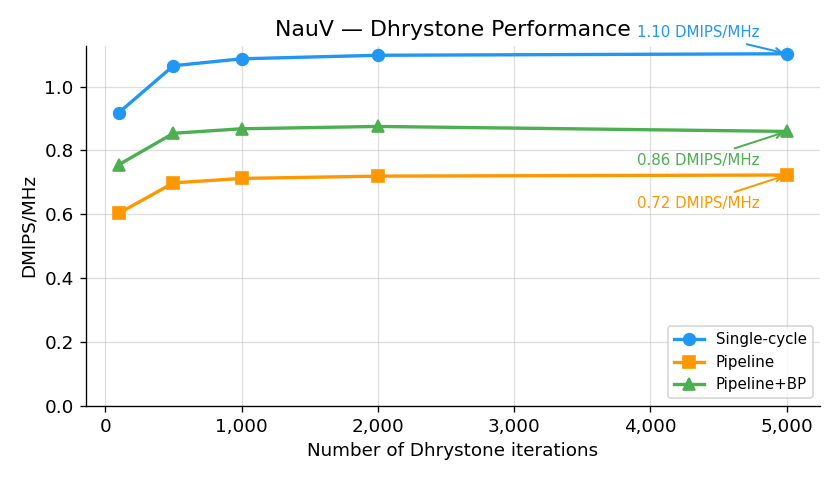
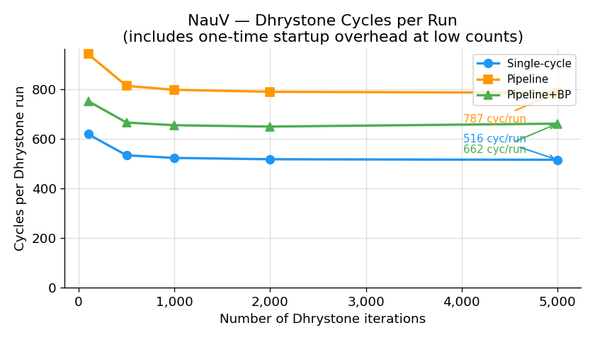
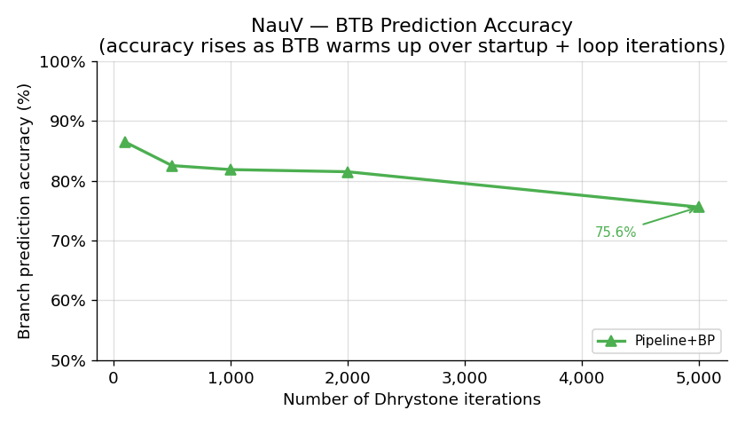

# Nau-V

A **RV32I** RISC-V processor core written in SystemVerilog, available in two microarchitectural variants:

| Variant | Description | CPI |
|---------|-------------|-----|
| **Single-cycle** (`core.sv`) | Every instruction completes in exactly one clock cycle | 1.0 |
| **5-stage pipeline** (`core_pipeline.sv`) | Classic IF/ID/EX/MEM/WB pipeline with full hazard handling | ≥1.0 (stalls on load-use, flush on branch) |
| **Pipeline + Branch Predictor** (`core_pipeline_bp.sv`) | 5-stage pipeline with 64-entry 2-bit saturating-counter BTB; correctly predicted branches cost 0 extra cycles | ≥1.0 (load-use stall only; branch penalty only on misprediction) |

Both variants implement the full base integer instruction set (RV32I, 47 instructions) and share identical port interfaces so testbenches, software, and synthesis scripts work unchanged for either design.

## Test Status

<!-- DASHBOARD_START -->
| Suite | Status | Details | Last run |
|-------|--------|---------|----------|
| Unit tests (Verilator) | $\color{green}{\textsf{PASS}}$ | 168/168 checks · 5/5 testbenches | 2026-03-14 21:55 UTC |
| riscv-tests RV32UI | $\color{green}{\textsf{PASS}}$ | 40/40 passed · 2 skipped | 2026-03-14 21:55 UTC |
<!-- DASHBOARD_END -->

*Updated automatically by the [pre-commit hook](.githooks/pre-commit) on every commit. Run `bash .githooks/pre-commit` to refresh manually.*

---

## Table of Contents

1. [Repository Layout](#repository-layout)
2. [Architecture](#architecture)
   - [Single-cycle](#single-cycle-coreSV)
   - [5-stage Pipeline](#5-stage-pipeline-core_pipelinesv)
   - [Pipeline + Branch Predictor](#pipeline--branch-predictor-core_pipeline_bpsv)
   - [Memory Map](#memory-map)
3. [RTL Modules](#rtl-modules)
4. [Testbenches](#testbenches)
5. [Compliance Testing](#compliance-testing)
6. [Software](#software)
7. [Dhrystone Benchmark](#dhrystone-benchmark)
8. [Synthesis](#synthesis)
9. [Future Work](#future-work)
   - [Performance](#performance)
   - [Security](#security)
   - [Verification & System Integration](#verification--system-integration)
10. [Tools & Dependencies](#tools--dependencies)
11. [Useful Commands](#useful-commands)

---

## Repository Layout

```
NauV/
├── src/
│   ├── if/         # Instruction Fetch stage
│   │   └── if_stage.sv
│   ├── id/         # Instruction Decode & Register Read stage
│   │   ├── decoder.sv
│   │   ├── regfile.sv
│   │   └── id_stage.sv
│   ├── ex/         # Execute stage
│   │   ├── alu.sv
│   │   └── ex_stage.sv
│   ├── mem/        # Memory Access stage
│   │   └── mem_stage.sv
│   ├── wb/         # Write Back stage
│   │   └── wb_stage.sv
│   └── core/       # Top-level integration + memories
│       ├── imem.sv
│       ├── dmem.sv
│       ├── core.sv                # Single-cycle top-level
│       ├── core_pipeline.sv       # 5-stage pipeline top-level
│       ├── core_pipeline_bp.sv    # 5-stage pipeline + branch predictor
│       ├── hazard_unit.sv         # Stall + flush controller (pipeline only)
│       └── branch_predictor.sv    # 64-entry 2-bit saturating-counter BTB
├── tb/             # SystemVerilog testbenches
│   ├── tb_alu.sv
│   ├── tb_regfile.sv
│   ├── tb_decoder.sv
│   ├── tb_if_stage.sv
│   ├── tb_core.sv
│   └── tb_prog.sv  # Generic program runner (works for both designs)
├── sim/
│   ├── Makefile                # Verilator build: PIPELINE=0/1, BRANCH_PREDICT=0/1
│   ├── run_dhrystone.sh        # Dhrystone sweep: PIPELINE=0/1, BRANCH_PREDICT=0/1
│   └── riscv-tests/            # RISC-V compliance test runner + NauV environment
├── software/
│   ├── startup/    # Shared bare-metal runtime (startup.S, link.ld, bin2hex.py)
│   ├── hello/      # Example C program
│   └── dhrystone/  # Dhrystone 2.1 benchmark port
├── synth/
│   ├── Makefile    # Synthesis targets: synth, timing, sweep, sweep_both, clean
│   ├── scripts/
│   │   ├── synth.tcl         # Yosys Tcl script (PIPELINE=0/1 env var)
│   │   ├── sta.tcl           # OpenSTA timing + power script
│   │   ├── mem_blackbox.v    # Black-box stubs for imem and dmem
│   │   ├── parse_reports.py  # Parse sweep reports → summary.csv
│   │   └── plot_results.py   # Comparison plots → docs/figures/
│   └── lib/                  # NanGate45 liberty file (gitignored, download separately)
├── scripts/
│   ├── update_dashboard.py  # README dashboard updater (used by pre-commit hook)
│   └── plot_dhrystone.py    # Dhrystone results plotter (single-cycle + pipeline)
└── docs/
    └── figures/    # Synthesis KPI and benchmark plots (tracked)
```

---

## Architecture

### Single-cycle (`core.sv`)

Every instruction completes in one clock cycle. All combinational paths connect directly from IF to WB within the same cycle. There are no pipeline registers. CPI = 1.0 for all instructions.

```
         ┌──────────────────────────────────────────────────────┐
  clk ──►│                                                      │
  rst ──►│  IF          ID           EX         MEM        WB  │
         │  ──────      ──────       ──────      ──────     ──  │
         │  if_stage    id_stage     ex_stage    mem_stage  wb  │
         │   │ PC        │ decode     │ ALU        │ dmem    │  │
         │   ▼           │ regfile    │ branch     │ ld/st   ▼  │
         │  imem         └────────────────────────────────► rd  │
         │                     ◄── WB writeback ──────────────  │
         └──────────────────────────────────────────────────────┘
```

### 5-stage Pipeline (`core_pipeline.sv`)

A classic five-stage in-order pipeline with full hazard handling. Module name and port interface are identical to `core.sv` — the Makefile selects which file to compile via `PIPELINE=0/1`.

```
  IF        ID        EX        MEM       WB
  ──────    ──────    ──────    ──────    ──────
  if_stage  id_stage  ex_stage  mem_stage wb_stage
    │  ───────►  ───────►  ───────►  ───────►
    │       IF/ID     ID/EX    EX/MEM   MEM/WB
    │       reg       reg      reg      reg
    │
    ◄─── flush (2 cycles on branch/jump) ────────
              ◄── EX/MEM forward ──────
              ◄──── MEM/WB forward ────────────
```

**Hazard handling:**

| Hazard | Cause | Resolution | Cost |
|--------|-------|------------|------|
| Load-use | Load in EX, dependent in ID | Stall IF+ID for 1 cycle, insert bubble into EX | +1 cycle |
| Control (branch/jump) | Branch/JALR resolves in EX | Flush IF+ID (2 bubbles) | +2 cycles |
| EX→EX data | Result in EX/MEM needed by EX | Forward `alu_result` → operand mux | 0 cycles |
| MEM→EX data | Result in MEM/WB needed by EX | Forward `rd_data` → operand mux | 0 cycles |
| WB→ID data | Writer in WB, reader in ID same cycle | Bypass `wb_rd_data` into ID/EX register | 0 cycles |

The WB→ID bypass is necessary because the register file's asynchronous read output doesn't settle in time for the `always_ff` ID/EX capture when WB writes in the same cycle.

Forwarding is suppressed for load results that are still in the MEM stage (a load-use stall handles those instead).

### Pipeline + Branch Predictor (`core_pipeline_bp.sv`)

A 5-stage pipeline identical to `core_pipeline.sv` but augmented with a 64-entry, direct-mapped **Branch Target Buffer (BTB)** using 2-bit saturating counters. The BTB is queried combinationally in the IF stage every cycle, so a correctly predicted branch or jump incurs **zero pipeline penalty**. Only mispredictions fall back to the same 2-cycle flush as the plain pipeline.

```
  BTB lookup (combinational, IF stage)
  ┌────────────────────────────────────┐
  │  PC[7:2] → index (6 bits)         │
  │  PC[31:8] → tag  (24 bits)        │
  │  2-bit saturating counter per entry│
  │  predict taken when cnt[1] = 1    │
  └──────────────┬─────────────────────┘
                 │ bp_pred_taken, bp_pred_target
                 ▼
  IF        ID        EX        MEM       WB
  ──────    ──────    ──────    ──────    ──────
  if_stage  id_stage  ex_stage  mem_stage wb_stage
    │         carry     ▲ resolve + BTB update
    ├──BTB──► bp_taken  │ misprediction → flush + correct
    └── pc_sel_comb ────┘ (mispred takes priority over BTB)
```

**Branch penalty summary:**

| Case | Prediction | Actual | Penalty |
|------|-----------|--------|---------|
| Correct prediction (taken) | taken | taken, same target | **0 cycles** |
| Correct prediction (not taken) | not taken | not taken | **0 cycles** |
| Misprediction — wrong direction | any | other | **2 cycles** |
| Misprediction — wrong target (JALR) | taken | taken, different target | **2 cycles** |

The BTB is updated whenever a branch or jump resolves in EX, carrying the actual outcome (taken/not-taken) and target address. The saturating counter transitions: `SN(00) → WN(01) → WT(10) → ST(11)`. A prediction is made (taken) when the counter's MSB is 1, i.e., `cnt ≥ 2`.

Selected by `PIPELINE=1 BRANCH_PREDICT=1` — the module name and port interface are identical to `core.sv` and `core_pipeline.sv`.

---

### Memory Map

| Region | Address Range | Size | Physical |
|--------|--------------|------|----------|
| Instruction memory | `0x0000_0000` – `0x0000_3FFF` | 16 KB | `imem` (read via PC) |
| Data memory | `0x0000_0000` – `0x0000_3FFF` | 16 KB | `dmem` (read/write via load/store) |
| Stack (top) | `0x0000_4000` | — | `dmem`, grows downward |

Both designs are **Harvard architecture**: instruction and data spaces share the same virtual address range but use separate physical memories.

---

## RTL Modules

All modules are written in SystemVerilog. Combinational logic uses `always_comb`; sequential logic uses `always_ff @(posedge clk)` with synchronous active-high reset. Signal names use `snake_case` prefixed by stage of origin (e.g. `id_rs1_addr`, `ex_alu_result`).

### IF — `if_stage`

**File:** `src/if/if_stage.sv`

Holds the Program Counter register. `pc_en` (active high) gates PC advance — used by the pipeline's hazard unit for stalls; the single-cycle core ties it high. `if_pc_plus4` is a combinational output used by JAL/JALR to save the return address.

| Port | Direction | Description |
|------|-----------|-------------|
| `clk`, `rst` | in | Clock and synchronous active-high reset |
| `pc_en` | in | `1` = advance PC; `0` = hold (stall) |
| `pc_sel` | in | `0` = PC+4, `1` = jump/branch target |
| `if_pc_target` | in | Target address from EX stage |
| `if_pc` | out | Current PC (registered) |
| `if_pc_plus4` | out | PC+4 (combinational) |

On reset, PC is set to `0x0000_0000`.

---

### ID — `decoder`

**File:** `src/id/decoder.sv`

Fully combinational decoder for all nine RV32I opcode groups. Given a 32-bit instruction word it produces register addresses, a sign-extended immediate, an ALU operation code, and a complete set of control signals for downstream stages.

| Opcode | Instructions |
|--------|-------------|
| R-type (`0110011`) | ADD, SUB, SLL, SLT, SLTU, XOR, SRL, SRA, OR, AND |
| I-type ALU (`0010011`) | ADDI, SLTI, SLTIU, XORI, ORI, ANDI, SLLI, SRLI, SRAI |
| Load (`0000011`) | LB, LH, LW, LBU, LHU |
| Store (`0100011`) | SB, SH, SW |
| Branch (`1100011`) | BEQ, BNE, BLT, BGE, BLTU, BGEU |
| JAL (`1101111`) | JAL |
| JALR (`1100111`) | JALR |
| LUI (`0110111`) | LUI |
| AUIPC (`0010111`) | AUIPC |

---

### ID — `regfile`

**File:** `src/id/regfile.sv`

32 × 32-bit general-purpose register file. `x0` is hardwired to zero. Reads are asynchronous; writes are synchronous on the rising clock edge.

---

### ID — `id_stage`

**File:** `src/id/id_stage.sv`

Wrapper that instantiates `decoder` and `regfile`. Exposes the register file's debug read port for testbenches.

---

### EX — `alu`

**File:** `src/ex/alu.sv`

Purely combinational. Implements all eleven RV32I ALU operations (ADD, SUB, SLL, SLT, SLTU, XOR, SRL, SRA, OR, AND, PASS_B) plus zero/neg/overflow status flags.

---

### EX — `ex_stage`

**File:** `src/ex/ex_stage.sv`

Selects ALU operands, instantiates `alu`, evaluates branch conditions, and computes the next-PC target. For branches, the ALU is forced to SUB so the zero/neg/overflow flags reflect `rs1 − rs2`. `ex_pc_sel` is asserted for any jump or taken branch.

---

### MEM — `mem_stage`

**File:** `src/mem/mem_stage.sv`

Purely combinational. Computes byte-enable signals and data alignment for stores (SB/SH/SW), and performs sign/zero extension for loads (LB/LBU/LH/LHU/LW).

---

### WB — `wb_stage`

**File:** `src/wb/wb_stage.sv`

Purely combinational. Selects write-back data from three sources: PC+4 (JAL/JALR), memory read data (loads), or ALU result (everything else).

---

### Core — `imem`

**File:** `src/core/imem.sv`

Asynchronous-read, 4096 × 32-bit instruction memory (16 KB). Initialised to NOP. Includes a clocked write port for testbench program loading.

---

### Core — `dmem`

**File:** `src/core/dmem.sv`

Synchronous-write, asynchronous-read, 4096 × 32-bit data memory (16 KB) with 4-bit byte-enable masking.

---

### Core — `core` / `core_pipeline` / `core_pipeline_bp` (top-level)

**Files:** `src/core/core.sv`, `src/core/core_pipeline.sv`, `src/core/core_pipeline_bp.sv`

All three modules are named `core` with identical port interfaces. The Makefile variables `PIPELINE=0/1` and `BRANCH_PREDICT=0/1` select which file compiles — no `ifdef` directives appear in the RTL.

`core_pipeline.sv` adds over `core.sv`:
- Four `always_ff` pipeline register blocks (IF/ID, ID/EX, EX/MEM, MEM/WB)
- `hazard_unit` instantiation for stall and flush control
- Combinational forwarding muxes for EX/MEM→EX and MEM/WB→EX paths
- WB→ID bypass in the ID/EX register block

`core_pipeline_bp.sv` adds over `core_pipeline.sv`:
- `branch_predictor` instantiation (64-entry BTB, queried combinationally in IF)
- Combined PC mux: misprediction correction takes priority over BTB prediction
- `if_id_bp_taken` / `if_id_bp_target` and `id_ex_bp_taken` / `id_ex_bp_target` pipeline register fields carrying the prediction forward to EX
- Misprediction detection: flushes only on wrong prediction, not every taken branch/jump
- Hazard unit's flush outputs are intentionally unconnected (flush driven by `ex_mispred` directly)

`hazard_unit.sv` detects load-use hazards (stall) and branch/jump resolution (flush), filtering `rs1`/`rs2` use by opcode to avoid spurious stalls.

`branch_predictor.sv` implements the 64-entry direct-mapped BTB. See [branch predictor architecture](#pipeline--branch-predictor-core_pipeline_bpsv) above for the full description.

---

## Testbenches

All testbenches are written in pure SystemVerilog and compiled with Verilator. Each is self-checking, prints `PASS`/`FAIL` per test case, and dumps a `.vcd` waveform.

| Testbench | What it tests | Checks |
|-----------|--------------|--------|
| `tb_alu.sv` | All 11 ALU operations, status flags | 33 |
| `tb_regfile.sv` | Reset, x0 protection, simultaneous reads, debug port | 13 |
| `tb_decoder.sv` | All instruction formats and control signals | 96 |
| `tb_if_stage.sv` | PC reset, sequential increment, branch redirect, stall | 13 |
| `tb_core.sv` | Full integration (single-cycle only): ALU, loads/stores, branches, jumps | 13 |
| `tb_branch_predictor.sv` | BTB cold miss, counter ramp (01→10→11), saturation, tag mismatch, two coexisting entries, target update, `bp_stall` hold | 19 |
| `tb_prog.sv` | Generic program runner — loads a compiled hex at runtime, monitors tohost | — |

`tb_core` is specific to single-cycle timing assumptions and is excluded from the pipeline test suite (compliance testing via `tb_prog` covers correctness instead).

`tb_branch_predictor` is compiled when `BRANCH_PREDICT=1` and is automatically included in `make run PIPELINE=1 BRANCH_PREDICT=1`.

`tb_prog` works with all three designs: tohost=1 → PASS, other non-zero → FAIL (encoding: `(TESTNUM<<1)|1`).

---

## Compliance Testing

Nau-V is verified against the official [riscv-tests](https://github.com/riscv-software-src/riscv-tests) RV32UI suite — 40 tests covering every RV32I instruction. Both the single-cycle and pipelined designs pass all 40 tests.

### Test coverage

| Category | Tests | Status |
|----------|-------|--------|
| Arithmetic & logic | `add` `addi` `sub` `and` `andi` `or` `ori` `xor` `xori` | PASS |
| Shifts | `sll` `slli` `srl` `srli` `sra` `srai` | PASS |
| Comparisons | `slt` `slti` `sltu` `sltiu` | PASS |
| Upper-immediate | `lui` `auipc` | PASS |
| Branches | `beq` `bne` `blt` `bltu` `bge` `bgeu` | PASS |
| Jumps | `jal` `jalr` | PASS |
| Loads | `lb` `lbu` `lh` `lhu` `lw` | PASS |
| Stores | `sb` `sh` `sw` | PASS |
| Misc | `simple` `ld_st` `st_ld` | PASS |
| Skipped | `fence_i` `ma_data` | Zifencei / trap handling — out of scope |

### Setup

```bash
# Clone the test suite once (gitignored at repo root)
git clone https://github.com/riscv-software-src/riscv-tests

# Single-cycle
./sim/riscv-tests/run_riscv_tests.sh

# Pipeline
./sim/riscv-tests/run_riscv_tests.sh --pipeline

# Pipeline + branch predictor
./sim/riscv-tests/run_riscv_tests.sh --branch-predict
```

All 40 applicable RV32UI tests pass for all three design variants.

---

## Software

### Bare-Metal Infrastructure

**Location:** `software/startup/`

| File | Purpose |
|------|---------|
| `startup.S` | Entry at `_start` (PC=0): sets `sp=0x4000`, zeroes `.bss`, calls `main` |
| `link.ld` | `.text` at `0x0` (→ imem); `.data`/`.bss`/stack in data space (→ dmem) |
| `bin2hex.py` | Converts raw binary to Verilog `$readmemh` hex format |

Compilation: `-march=rv32i -mabi=ilp32 -nostdlib -ffreestanding`.

Because the core is Harvard, initialised globals (`.data`) must be loaded via a separate `data.hex` file — they cannot be copied from imem at startup.

### Hello World

**Location:** `software/hello/`

Eight arithmetic/logic tests; writes `tohost=1` on success or an error code identifying the failing test.

---

## Dhrystone Benchmark

Dhrystone 2.1 is the classic synthetic integer benchmark. The metric is **DMIPS/MHz**:

```
DMIPS/MHz = (iterations × 1,000,000) / (cycles × 1757)
```

### Results

| Iterations | SC Cycles | SC DMIPS/MHz | PL Cycles | PL DMIPS/MHz | PL+BP Cycles | PL+BP DMIPS/MHz | BP Accuracy |
|------------|-----------|-------------|-----------|-------------|--------------|----------------|-------------|
| 100  | 61,960  | 0.92 | 94,313  | 0.60 | 84,924  | 0.67 | 86.5% |
| 500  | 267,160 | 1.07 | 407,513 | 0.70 | 370,924 | 0.77 | 82.6% |
| 1,000 | 523,660 | 1.09 | 799,013 | 0.71 | 728,424 | 0.78 | 81.9% |
| 2,000 | 1,036,660 | 1.10 | 1,582,013 | 0.72 | 1,443,424 | 0.79 | 81.5% |
| 5,000 | 2,580,660 | **1.10** | 3,936,013 | **0.72** | 3,633,408 | **0.78** | 75.6% |

*SC = Single-cycle · PL = Pipeline · PL+BP = Pipeline + Branch Predictor*

The single-cycle design scores **1.10 DMIPS/MHz** at steady state (~516 cycles/iteration). The plain pipeline scores **0.72 DMIPS/MHz** (~787 cycles/iteration) — Dhrystone is stall-heavy with frequent load-use sequences and many short backward loops, each costing the 2-cycle branch-flush penalty. Adding the branch predictor improves this to **0.78 DMIPS/MHz** (~727 cycles/iteration), a **+8% improvement** over the plain pipeline.

The Branch Predictor uses **registered** outputs (1-cycle latency), so a correctly predicted taken branch costs 1 pipeline cycle instead of 0. This reduces the Dhrystone improvement compared to a purely combinational BTB (which would cost 0 cycles but cannot close timing above ~12 MHz in synthesis) while enabling a **200 MHz Fmax** in NanGate45 — the best of all three designs.

**Branch prediction accuracy:** The overall accuracy ranges from 75–87% across the sweep. At small N (N=100), the startup code (BSS zeroing, record initialisation) dominates and contains highly repetitive loops that the predictor handles well after the first pass (~86% accuracy). At large N (N=5000), the Dhrystone main loop dominates; it contains many short conditional branches with semi-alternating outcomes (string comparisons, struct-access conditions) that are harder for a 2-bit saturating counter, pulling the cumulative accuracy to ~76%. A 2-bit counter needs 2 consecutive same-direction outcomes to change prediction, so it handles persistent biases well but alternating branches less so. An 8-bit or global-history predictor would improve this.

For context: ARM Cortex-M0 ~0.9 DMIPS/MHz; Cortex-M3 ~1.25 DMIPS/MHz.

### Figures

| DMIPS/MHz vs iterations | Cycles per run vs iterations |
|:-:|:-:|
|  |  |

| BTB prediction accuracy vs iterations | |
|:-:|:-:|
|  | The accuracy plot is generated automatically when `dhrystone_pipeline_bp.csv` contains the `bp_accuracy` column (set by `BRANCH_PREDICT=1 bash sim/run_dhrystone.sh`). Accuracy starts high when startup loops dominate and settles lower as the complex Dhrystone branch mix takes over. |

### Implementation Notes

String constants normally go to `.rodata` (imem) and cannot be read by load instructions on a Harvard core. The benchmark stores all Dhrystone strings in `.data` (→ dmem), loaded via `dhrystone.data.hex`.

tohost address is **0x3000** — above the `.bss` region (0x0628–0x2E60), so the startup BSS-zero loop doesn't trigger a false signal.

---

## Synthesis

The `synth/` directory contains a complete logic synthesis flow targeting **NanGate 45 nm** open-source standard-cell library. All three designs can be synthesised via `PIPELINE=0/1` and `BRANCH_PREDICT=0/1`.

`imem`/`dmem`/`branch_predictor` are black-boxed (SRAM macros in silicon). All metrics reflect **datapath logic only**.

### Results at 100 MHz

| Metric | Single-cycle | Pipeline | Pipeline+BP |
|--------|-------------|----------|-------------|
| **Area** | 13,852 µm² | 17,099 µm² | 17,513 µm² |
| **Area (GTE)** | 17,358 | 21,427 | 21,946 |
| **WNS** | +4.822 ns | +4.870 ns | **+5.000 ns** |
| **Fmax (estimated)** | ~193 MHz | ~195 MHz | **~200 MHz** |
| **Power** | 1.34 mW | 1.89 mW | 1.93 mW |

The Pipeline+BP achieves the **highest Fmax** of all three designs. The BTB's registered outputs eliminate the combinational path from the PC register through the 64-entry mux tree back to the PC register. The PC redirect in ID now starts from a register output (`bp_pred_taken` / `bp_pred_target`), cutting the critical path from ~5.13 ns to 5.00 ns.

The BTB is black-boxed in synthesis — in real silicon it would be an SRAM macro (identical rationale to `imem`/`dmem`). The small area overhead (+2% over plain pipeline) reflects only the additional ID-stage redirect logic, the `bp_stall` signal, and the two `id_ex_bp_*` pipeline registers.

### Frequency Sweep (50–250 MHz)

| Freq | SC WNS | SC Power | PL WNS | PL Power | PL+BP WNS | PL+BP Power |
|------|--------|----------|--------|----------|-----------|-------------|
| 50 MHz  | +14.822 ns | 0.83 mW | +14.870 ns | 1.14 mW | +15.000 ns | 1.16 mW |
| 100 MHz | +4.822 ns  | 1.34 mW | +4.870 ns  | 1.89 mW | +5.000 ns  | 1.93 mW |
| 150 MHz | +1.489 ns  | 1.86 mW | +1.536 ns  | 2.65 mW | +1.667 ns  | 2.70 mW |
| 200 MHz | −0.178 ns  | 2.37 mW | −0.130 ns  | 3.40 mW | **0.000 ns** | 3.46 mW |
| 250 MHz | −1.178 ns  | 2.88 mW | −1.130 ns  | 4.16 mW | −1.000 ns  | 4.23 mW |

**Fmax (sweep): 150 MHz** for Single-cycle and Pipeline · **200 MHz** for Pipeline+BP


> Area stays flat across the sweep because Yosys+ABC is a one-shot mapper. Area/speed
> tradeoffs become visible in a full place-and-route flow (e.g. OpenROAD).

### Running synthesis

```bash
# Download NanGate45 liberty file (once)
mkdir -p synth/lib
curl -L "https://raw.githubusercontent.com/The-OpenROAD-Project/OpenROAD-flow-scripts/master/flow/platforms/nangate45/lib/NangateOpenCellLibrary_typical.lib" \
     -o synth/lib/NangateOpenCellLibrary_typical.lib

cd synth

# Baseline synthesis + STA (single-cycle)
make all

# Baseline synthesis + STA (pipeline)
make all PIPELINE=1

# Baseline synthesis + STA (pipeline + branch predictor)
make all PIPELINE=1 BRANCH_PREDICT=1

# Frequency sweep — single design
make sweep                              # single-cycle
make sweep PIPELINE=1                   # pipeline
make sweep PIPELINE=1 BRANCH_PREDICT=1 # pipeline + branch predictor

# Frequency sweep — both designs + comparison plots
make sweep_both

# Frequency sweep — all three designs + comparison plots
make sweep_all
```

---

## Future Work

### Performance

The five-stage pipeline with branch predictor scores **0.78 DMIPS/MHz** and closes timing at **200 MHz** in NanGate45 (BTB black-boxed as SRAM). The following improvements would have additional impact on those two metrics.

---

#### 1. Branch predictor ✅ IMPLEMENTED

**Achieved: Dhrystone +8% over plain pipeline, Fmax 200 MHz (`core_pipeline_bp.sv`)**

A 64-entry 2-bit saturating-counter BTB was implemented in `src/core/branch_predictor.sv` and integrated into `src/core/core_pipeline_bp.sv`. The BTB uses **registered outputs** (`bp_stall` held during load-use stalls) so the PC redirect is applied in the ID stage (1-cycle penalty for correctly predicted taken branches). This design closes timing at **200 MHz** in NanGate45 (vs 150 MHz for plain pipeline) because the PC mux critical path now sees only short register-to-register logic, not a 64-entry mux tree. Mispredictions incur the same 2-cycle flush as the plain pipeline. The plain pipeline scored 0.72 DMIPS/MHz; the branch-predicted pipeline scores 0.78 DMIPS/MHz at steady state. Selected with `PIPELINE=1 BRANCH_PREDICT=1`.

See [architecture description](#pipeline--branch-predictor-core_pipeline_bpsv) for the full design and [Dhrystone results](#results) for performance numbers.

---

#### 2. RV32M — hardware multiply and divide

**Impact: Dhrystone +10–20%, eliminates compiler-generated multiply loops**

The RISC-V M extension adds `MUL`, `MULH`, `DIV`, `REM` and their unsigned variants. The compiler currently expands integer multiply into a sequence of shifts and adds (typically 8–16 instructions per multiply). A single-cycle or multi-cycle hardware multiplier replaces this with one instruction.

Dhrystone's inner loop contains several integer multiplies. A 1-cycle `MUL` (using a carry-save or Wallace tree in the ALU) would shrink the cycle count per iteration by roughly 30–50 cycles and improve `DMIPS/MHz` proportionally.

Implementation path: extend the ALU with a pipelined or iterative 32×32 multiplier, add new opcodes to the decoder, and handle the result latency with an existing load-use-style stall or an EX-stage pipeline register.

---

#### 3. Deeper pipeline to increase Fmax

**Impact: Fmax +50–100 MHz, Dhrystone neutral**

The current critical path runs through the decode → forwarding mux → ALU → branch evaluation chain (~5.2 ns in NanGate45, Fmax ~193 MHz estimated). Splitting EX into two stages — one for ALU operand selection and the other for branch resolution and result writeback — would halve the critical path through EX and push Fmax above 250 MHz.

A 7-stage pipeline (IF / ID / RF / EX1 / EX2 / MEM / WB) is a common industry choice for embedded cores targeting 200–400 MHz in 45 nm. The forwarding and hazard logic becomes slightly more complex (one additional forwarding path, branch penalty grows to 3 cycles), but the Fmax gain compounds with any clock-frequency advantage.

---

#### 4. Store-to-load forwarding

**Impact: Dhrystone +3–5%, eliminates a class of memory stalls**

When a store is immediately followed by a load to the same address (a common pattern in struct member accesses and stack spills/reloads), the loaded value could be sourced directly from the store's write data rather than waiting for dmem to be written and read back. This eliminates the 1-cycle dmem round-trip latency for the common store-then-load pattern.

Implementation path: compare the load address (EX/MEM) with the most recent store address (MEM/WB). On a hit, forward store write data to the load result, bypassing dmem. Requires adding an address comparator and a forwarding mux on the load data path.

---

#### 5. Dual-issue superscalar

**Impact: Dhrystone +40–60%, area +60–80%**

Issue two independent instructions per cycle from a pair of adjacent instruction slots. Even a restricted dual-issue policy — one ALU instruction plus one load/store, with no inter-slot dependency allowed — captures a large fraction of available instruction-level parallelism (ILP) in integer code. Dhrystone alternates between arithmetic and memory operations in most of its inner loops, making it a good fit for this policy.

Implementation path: fetch two instructions per cycle from imem (requires a 64-bit fetch bus or a 2-entry fetch buffer), decode both, check for inter-slot RAW hazards, and route to two parallel execution units. The register file needs four read ports and two write ports. Forwarding becomes significantly more complex. Area approximately doubles for the execution datapath but not for the memories.

---

### Security

The following features would make NauV relevant to an embedded security IP roadmap. They address the most common attack classes — memory corruption, control-flow hijacking, privilege escalation, side-channel leakage, and fault injection — using hardware mechanisms that software-only mitigations cannot replicate.

---

#### 1. Physical Memory Protection (PMP)

**Attack class: privilege escalation, memory corruption**

PMP is part of the RISC-V privileged specification. It enforces read/write/execute access permissions on up to 16 physical memory regions per hart. Every memory access is checked against the PMP table; violations cause a trap. This is the foundation of a secure embedded system: untrusted code runs in User mode and cannot access kernel memory, peripheral registers, or code regions it is not authorised to execute.

Implementation: add a PMP check unit on both the instruction fetch bus (PC → imem) and the data bus (mem_addr → dmem). Add 16 pairs of `pmpcfg` and `pmpaddr` CSRs. Requires adding M/U privilege mode support (see idea #4).

---

#### 2. Control Flow Integrity (CFI) — hardware shadow stack

**Attack class: return-oriented programming (ROP), JOP**

Return-oriented programming chains together existing code gadgets by corrupting return addresses on the stack. A hardware shadow stack maintains a second, hardware-protected copy of return addresses in a dedicated register file (not addressable by normal loads/stores). On `JAL`/`JALR` (call), the return address is pushed to the shadow stack. On `JALR ra, 0(ra)` (return), the hardware compares the software stack return address to the shadow stack top and traps if they differ.

This is equivalent to Intel CET (Control-flow Enforcement Technology) shadow stack or ARM BTI/GCS at the hardware level. It defeats ROP with zero software overhead once the shadow stack is populated by the call instruction.

Implementation: add a small (32-entry) LIFO register file as the shadow stack. Hook `JAL`/`JALR` call detection in the ID stage. Add a comparison check in EX and a trap output to the pipeline.

---

#### 3. Side-channel resistance — constant-time ALU paths

**Attack class: timing side channels (e.g., timing attacks on AES, RSA, ECC)**

Timing side channels exploit data-dependent execution time to recover secret keys. In the current pipeline, branch outcomes and load/store addresses are data-dependent, making execution time observable by an attacker monitoring power or timing. Two hardware mitigations are most impactful for embedded crypto:

- **Data-independent timing for branches**: add a "constant-time mode" bit in a CSR that suppresses branch prediction and forces all branches to take a fixed 2-cycle path regardless of the condition outcome. The pipeline executes both paths and muxes the correct PC at the end — no timing difference is visible.
- **Cache/memory access obfuscation**: add address scrambling or access padding so that load/store timing does not reveal the address pattern.

This is analogous to the `DIT` (Data Independent Timing) bit in ARMv8.4-A. It is essential for any core that will run cryptographic code without a software-only constant-time discipline.

---

#### 4. Privilege modes (M-mode / U-mode) and trap architecture

**Attack class: privilege escalation, arbitrary code execution**

RISC-V defines Machine mode (M), Supervisor mode (S), and User mode (U). For an embedded security core, adding M+U is the minimum useful configuration. M-mode runs trusted firmware (bootloader, crypto services, key management); U-mode runs untrusted application code. A trap from U-mode into M-mode is the enforcement point for all other security features.

Requires adding: `mtvec`, `mepc`, `mcause`, `mstatus`, `mie`/`mip` CSRs; a CSR read/write instruction (`CSRRW`, `CSRRS`, `CSRRC`); trap entry/exit logic in the pipeline (flush, redirect to `mtvec`, save `mepc`). The CSR unit can be added as a new stage module between EX and MEM, or handled as a special case in WB.

---

#### 5. Fault injection detection — pipeline register parity

**Attack class: fault injection (voltage glitching, clock glitching, laser fault injection)**

Fault injection attacks corrupt register values or skip instructions by briefly disrupting the supply voltage or clock. A common target is security-critical checks: an attacker flips the result of a signature verification or memory permission check from "fail" to "pass" using a single bit-flip.

Parity bits on the pipeline registers detect single-bit faults: each pipeline register stage (IF/ID, ID/EX, EX/MEM, MEM/WB) stores a parity bit alongside the data. On every cycle, the parity is recomputed from the register outputs and compared to the stored parity. A mismatch signals a fault, which can trigger a trap, a core reset, or an external alert pin.

This adds ~1 bit of overhead per data bit in the pipeline registers (roughly 5% area overhead) and a parity tree on the critical path (negligible timing impact). Stronger protection uses ECC (detect and correct single-bit, detect double-bit) at higher area cost.

---

### Verification & System Integration

---

#### 6. CSR unit (Control and Status Registers)

**Prerequisite for: privilege modes, PMP, side-channel resistance, fault detection**

The RISC-V privileged specification defines a set of machine-readable control and status registers accessed via `CSRRW`, `CSRRS`, `CSRRC`, `CSRRWI`, `CSRRSI`, `CSRRCI` instructions. CSRs are the universal knob-and-dial interface of a RISC-V core: they expose the current privilege level, trap vectors, interrupt enables, hardware performance counters, and any custom extension registers.

A minimal useful CSR set for NauV:

| CSR | Address | Purpose |
|-----|---------|---------|
| `mstatus` | `0x300` | Global interrupt enable, privilege mode |
| `misa` | `0x301` | ISA capabilities advertisement |
| `mtvec` | `0x305` | Trap vector base address |
| `mscratch` | `0x340` | Scratch register for trap handlers |
| `mepc` | `0x341` | Exception program counter (saved PC on trap) |
| `mcause` | `0x342` | Trap cause code |
| `mtval` | `0x343` | Trap value (faulting address or instruction) |
| `mcycle` | `0xC00` | Clock cycle counter (used by `rdcycle`) |
| `minstret` | `0xC02` | Retired instruction counter |

Implementation path: add a `csr_unit` module between EX and MEM. The decoder emits a `csr_op` signal and the CSR address from `instr[31:20]`; the CSR unit performs the read-modify-write and drives `csr_rd_data` to the WB mux. Trap entry/exit logic flushes the pipeline and redirects the PC to `mtvec` or `mepc`.

Adding CSRs unlocks every privilege and security feature described above, enables the standard RISC-V timer interrupt (`mtime`/`mtimecmp`), and lets benchmarks use `rdcycle` for cycle-accurate timing without relying on simulation-only tohost writes.

---

#### 7. UVM testbench

**Impact: industrial-grade functional coverage, constrained-random stimulus, regression automation**

The current testbenches are directed, self-checking SystemVerilog modules. They are effective for verifying known corner cases but cannot explore the enormous instruction-sequence space systematically. A **Universal Verification Methodology (UVM)** testbench replaces directed stimulus with constrained-random generation, structured coverage collection, and reusable verification components.

A NauV UVM environment would be structured as follows:

```
uvm_test
└── uvm_env
    ├── riscv_agent              # drives instruction streams into the core
    │   ├── riscv_sequencer      # generates constrained-random instruction sequences
    │   ├── riscv_driver         # loads hex into imem/dmem, drives clk/rst
    │   └── riscv_monitor        # captures DUT outputs (PC, register file, tohost)
    ├── reference_model          # ISS (e.g. Spike or a SV golden model) running in parallel
    ├── scoreboard               # compares DUT register file / memory state to reference
    └── coverage_collector       # tracks instruction opcodes, hazard combinations,
                                 # branch outcomes, forwarding paths hit
```

Key coverage points to track: all 47 RV32I opcodes exercised; all forwarding path combinations (EX→EX, MEM→EX, WB→ID bypass); load-use stall triggered for each load width (LB/LH/LW); consecutive loads; branch-in-delay-slot; CSR read-modify-write sequences.

A functional coverage closure target of 100% on a defined coverage model gives a measurable, auditable verification sign-off — something directed tests cannot provide.

---

#### 8. APB peripheral bus

**Impact: system integration, CSR/peripheral access from outside the core**

The **Advanced Peripheral Bus (APB)** is the lowest-complexity member of the ARM AMBA bus family. It is widely used to connect slow peripherals — timers, UARTs, GPIO, security accelerators — to an SoC interconnect. Adding APB support to NauV enables two complementary use cases:

**Core-as-master (program-driven):** the MEM stage drives an APB master interface instead of (or alongside) the private dmem. Load/store instructions to a defined peripheral address range are translated into APB transactions. This is how the core reads/writes external registers — including its own CSRs if they are mapped to APB rather than implemented internally.

```
 NauV core                         APB fabric
 ─────────────────────────         ──────────────────────
 mem_addr  ──► APB master ──PSEL─► CSR peripheral
               interface   PENABLE  Timer
                            PWRITE  UART
                            PWDATA  Crypto accelerator
                           ◄PRDATA
```

**Core-as-slave (debug/control from outside):** an APB slave port on the core allows an external debug host or test harness to read and write core registers — including the register file, PC, and CSRs — without halting the core. This replaces the current ad hoc `dbg_*` debug ports with a standard interface any AXI/APB interconnect can drive.

For verification, an APB UVM agent (sequencer + driver + monitor) can be reused from any standard VIP library and composed with the instruction-level UVM agent described above to form a complete system-level testbench. The UVM scoreboard then validates that APB register reads reflect the correct post-instruction core state — closing the loop between the two stimulus paths.

---

## Tools & Dependencies

| Tool | Version | Purpose |
|------|---------|---------|
| [Verilator](https://www.veripool.org/verilator/) | ≥ 5.0 | RTL simulation |
| [GTKWave](https://gtkwave.sourceforge.net/) | any | Waveform viewing |
| `gcc-riscv64-unknown-elf` | any | Bare-metal C/assembly compiler |
| `binutils-riscv64-unknown-elf` | any | `objcopy`, `objdump`, linker |
| [Yosys](https://github.com/YosysHQ/yosys) | ≥ 0.35 | Logic synthesis |
| [OpenSTA](https://github.com/The-OpenROAD-Project/OpenSTA) | any | Static timing analysis + power |
| Python | ≥ 3.10 | `bin2hex.py`, synthesis report scripts |
| Make | any | Build system |

Install RISC-V toolchain on Ubuntu/Debian:

```bash
sudo apt install gcc-riscv64-unknown-elf binutils-riscv64-unknown-elf picolibc-riscv64-unknown-elf
```

---

## Useful Commands

### Run unit tests

```bash
cd sim

# Single-cycle (default)
make run

# Pipeline
make run PIPELINE=1

# Pipeline + branch predictor (includes tb_branch_predictor)
make run PIPELINE=1 BRANCH_PREDICT=1
```

### Run a compiled program

```bash
cd sim

# Single-cycle
make prog TEXT=../software/hello/hello.text.hex

# Pipeline
make prog TEXT=../software/hello/hello.text.hex PIPELINE=1

# Pipeline + branch predictor
make prog TEXT=../software/hello/hello.text.hex PIPELINE=1 BRANCH_PREDICT=1
```

### Open waveform in GTKWave

```bash
cd sim
make wave MOD=tb_core           # single-cycle only
make wave MOD=tb_alu            # shared
```

### RISC-V compliance tests

```bash
# Clone once (gitignored)
git clone https://github.com/riscv-software-src/riscv-tests

# Single-cycle
./sim/riscv-tests/run_riscv_tests.sh

# Pipeline
./sim/riscv-tests/run_riscv_tests.sh --pipeline

# Pipeline + branch predictor
./sim/riscv-tests/run_riscv_tests.sh --branch-predict

# Verbose output on failure
./sim/riscv-tests/run_riscv_tests.sh --branch-predict --verbose
```

### Dhrystone benchmark

```bash
# Full sweep → reports/dhrystone.csv
bash sim/run_dhrystone.sh

# Pipeline sweep → reports/dhrystone_pipeline.csv
PIPELINE=1 bash sim/run_dhrystone.sh

# Pipeline + branch predictor sweep → reports/dhrystone_pipeline_bp.csv
BRANCH_PREDICT=1 bash sim/run_dhrystone.sh

# Regenerate comparison plots (all three designs)
python3 scripts/plot_dhrystone.py
```

### Synthesis

```bash
cd synth

# Single-cycle baseline
make all

# Pipeline baseline
make all PIPELINE=1

# Frequency sweep, single design
make sweep             # single-cycle
make sweep PIPELINE=1  # pipeline

# Both designs with comparison plots
make sweep_both

# Clean all generated files
make clean
```

### Pre-commit hook

```bash
# Activate once per clone
git config core.hooksPath .githooks

# Run manually
bash .githooks/pre-commit

# Bypass for WIP commits
git commit --no-verify -m "wip: ..."
```
